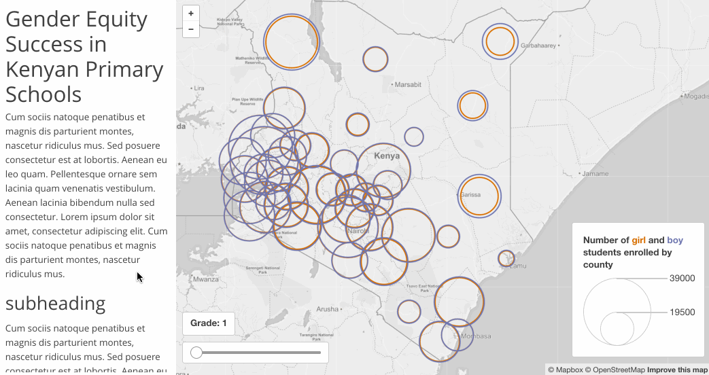
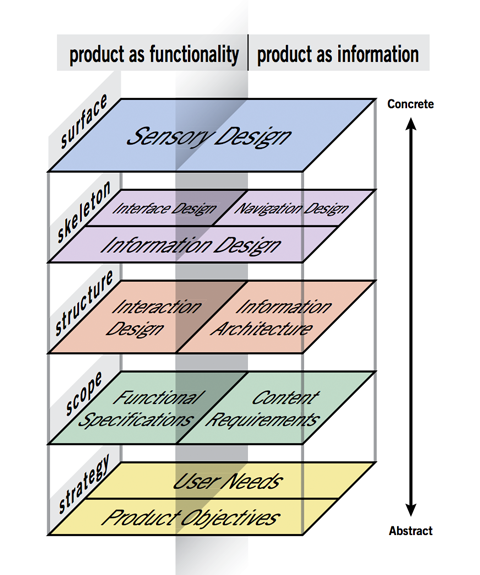
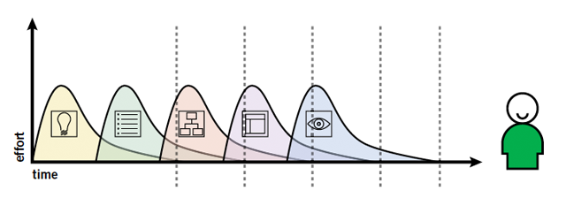
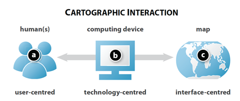
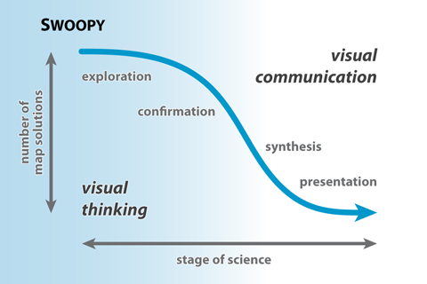
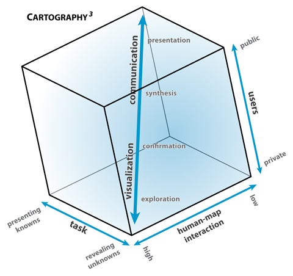
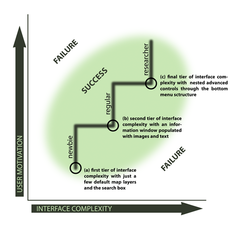

# Lesson 05: Mapping Workflow Part II &ndash; Data Representation and Map Refinement

## Overview

This lesson continues from Lesson 04 to guide us through a complete web mapping workflow. We left off in Lesson 04 with the data organized in a particular way and loaded into the script. The next step is to provide the code that will represent these data in a cartographically thematic way. However, choosing particular paths and moving forward through a mapping process does not always guarantee success.

## Table of Contents
<!-- TOC -->

- [Lesson 05: Mapping Workflow Part II &ndash; Data Representation and Map Refinement](#lesson-05-mapping-workflow-part-ii-ndash-data-representation-and-map-refinement)
    - [Overview](#overview)
    - [Table of Contents](#table-of-contents)
    - [Objective](#objective)
    - [Introduction](#introduction)
    - [A brief digression into cartographic interaction](#a-brief-digression-into-cartographic-interaction)
        - [1. What is cartographic interaction, and how does it different than traditional static map development?](#1-what-is-cartographic-interaction-and-how-does-it-different-than-traditional-static-map-development)
        - [2. Why do we provide cartographic interaction, and what value does it provide for the user experience?](#2-why-do-we-provide-cartographic-interaction-and-what-value-does-it-provide-for-the-user-experience)
        - [3. When do we provide cartographic interaction and how much?](#3-when-do-we-provide-cartographic-interaction-and-how-much)
        - [4. To whom do we provide cartographic interaction?](#4-to-whom-do-we-provide-cartographic-interaction)
        - [5. Where in a computing device is interaction provided?](#5-where-in-a-computing-device-is-interaction-provided)
        - [6. How do we identify and implement an appropriate interaction solution?](#6-how-do-we-identify-and-implement-an-appropriate-interaction-solution)
    - [Principals of cartographic interface design](#principals-of-cartographic-interface-design)
    - [Resources](#resources)

<!-- /TOC -->

## Objective

At times there is a need to get the data processed and visualized on the map quickly, which is what's known as a **rapid prototype**, before committing to polishing and enhancing the map.

You can use your completed assignment 04 files. Also, you are provided a backup with the *index.html* file within the *assignment/* directory, as well as the correctly formatted *assignment/data/kenya_education_2014.csv* data file, custom Javascript *assignment/js/app.js* file, and custom CSS *assignment/css/styles.css* file.

These files pick up where Lab 04 left off. Feel free to use these files to practice through the lesson/lab moving forward (or you can continue to extend your solution from Module 04).

By the end of this module, we'll have built a map that looks and behaves like this:

  
*Completed map for Module 05.*

Notice that:

* the UI slider sequences through the grade levels
* the current grade level is updated in the output above the slider
* mousing over the proportional symbols displays a custom-built info window containing raw totals for the current grade level and a "sparkline" of that feature's values across the grade levels

Read carefully through the lesson below before moving on to [complete the assignment](assignment).

## Introduction

By the end of module 04, we were making our way from the more abstract planes of project **strategy** and **scope** into the **structure** plane, where we addressed questions of interaction design and information architecture.

  
*Product as function and information through the elements of experience plane.*

Within the **strategy plain**, we considered the broader goals of the project and asked, "Why are we making this?" In answering that question, we identified our objectives for the product, and they addressed the needs of our target user.

After articulating why were going to make the product, we moved into the **scope plane** to ask, "What are we going to make?" While, of course, we were hungry to make a map, the answer to this question may sometimes be another information graphic, such as a chart. A consideration of the data prompted us to consider various thematic mapping types and develop a list of both the **functional specifications** and **content requirements** of the intended product.

We then moved into the **structure plane** where we asked, "How is it going to work"? For us, this involved closely examining our data and organizing it in a useful way for its incorporation into the web map. We also began building our boilerplate template of HTML, CSS, and JavaScript using the [Assembly CSS framework](https://www.mapbox.com/assembly/), and loading in some libraries we'll anticipate needing (i.e., Mapbox.js, Omnivore). After this was complete, we loaded our data into the map itself and plotted our county centroids as simple Leaflet markers. We also used Leaflet to select an HTML input for our range slider and a black div element where we will draw our legend.

Bear in mind that these planes are not mutually exclusive, and not do the necessitate a strictly linear path through a design process. It's not as if we check one plane off the list and move on entirely into the next. Processes of design are always cyclical and iterative. Garrett himself recommends planning your project to have work on each plane finish *before* work on the next can *finish* &mdash; not before it begins! This will help ensure a positive, successful user experience.

  
*Finishing work on each plane before the next can finish.*

While we move into the **skeleton** plane next, it's vital to think through the interaction design in particular, as this is closely linked with the design of the interface itself. **User experience (UX)** design is the iterative set of design decisions that lead to a successful experience with the map, as framed and illustrated conceptually through Garrett's elements of the user experience we're using to guide our process. **User interface (UI)** design is the set of design decisions that lead to the successful implementation of an interactive map. Interface design becomes much more concrete yet brings with it important considerations of interaction design from the structure plane.

Before we move on to the **skeleton** plane and the details of this particular interface design, let's step through some cartographic concepts relating to UX and UI web map development.

## A brief digression into cartographic interaction

Following from Roth (2013), we can ask ourselves six fundamental questions of cartographic interaction:

1. **what** is cartographic interaction and how does it different than traditional static map development?
2. **why** do we provide cartographic interaction, and what value does it provide for the user experience?
3. **when** do we provide cartographic interaction and how much?
4. to **whom** do we provide interaction?
5. **where** in a computing device is interaction offered?
6. **how** do we identify and implement an appropriate interaction solution?

### 1. What is cartographic interaction, and how does it different than traditional static map development?

Cartographic interaction is a critical component of a successful web map experience, and we achieve this through a user interface. We can think of the interface as facilitating a dialogue between the human and the map.

  
*Roth's (2013) model of cartographic interaction.*

According to Roth's schematic, this dialog occurs through the component medium of the computing device.

### 2. Why do we provide cartographic interaction, and what value does it provide for the user experience?

The are many reasons we provide cartographic interaction for our user. Interactivity may aid in decision making, spark curiosity to engage with the map, or may simply make the map more fun to use.

Academic cartographers have developed models to help conceptualize why we use cartographic interaction. One diagram suggests the reasons range from facilitating visual thinking and exploration of a data set to communicate a known pattern or data signature. The so-called "Swoopy" diagram (below), developed by David DiBiase in 1990, suggests that the number of possible map solutions is highest when we want to use a map to explore the data visually. Here we may introduce interaction solutions to help visualize the data in different ways and test, reject, or confirm specific hypotheses.

As our understanding of the data becomes clearer (as both mapmakers and the users of these maps), we move from a zone of visual thinking into more one of communicating and presenting the information in a particular manner. The number of map solutions decreases, and constraints on the possible interaction will help the user experience the map more purposefully.

  
*Swoopy diagram showing visual thinking and visual communication.*

This continuum from exploration to presentation is then incorporated into another classic diagram know as "cartography cubed,"  which considers mapping along three axes:

1. like the Swoopy diagram suggests, map tasks range from exploring data and revealing unknowns to presenting or communicating knowns,
2. the interaction provided may vary from low to high,
3. the intended users may range from the general public to a private audience (again, think how these users' goals may differ).

The success of a map lies in not trying to fill this entire cube, but rather a specific corner.

  
*Cartography cubed, diagram modified by Roth from MacEachren (1994).*

Let's consider some examples to clarify where various maps may fall within this cube. Say we have a massive dataset of climate data, consisting of many different attributes (e.g., temperature, wind speed, precipitation, humidity, air pressure) and encompassing many different temporal units (e.g., hourly data for all these attributes for a few decades). This is a very complicated dataset, and we may not yet know what these data can tell us.

Therefore, we may wish to build a map and map interface located at the lower corner of the cube: in other words, our task is to reveal unknowns. We, therefore, provide a high level of interaction (e.g., the ability to filter the data in many ways, or perhaps using coordinated, linked views to see the spatial data in a histogram or scatter plot to compare trends better). Furthermore, maybe this map is built for some climate scientists to understand their data better. It's not necessarily a public map.

However, as such a map may allow us to pull out significant trends from the data and identify a more straightforward story, we may build another map (or scale back the existing one) as the task shifts from exploring the data to presenting a subset of it. As we do this, we need less interaction, and the map may come to serve more of a public audience (e.g., demonstrating fluctuations between heat indices and humidity in a particular region during El Nino).

In terms of learning some terminology, we can consider the use of interaction to enhance the visual communication and presentation of the information within the map as **interactive cartography**. Looking at the cube, these maps tend toward presenting known information to a public audience and provide a lower level of map interaction. In other words, we only want to give the user the ability to manipulate the map in ways to further their understanding of the information we wish to present (that is, if it helps them reach their goal or objective).

The term **geovisualization**, by contrast, refers to map interface designs that exist toward the opposite corner of the cube: maps that provide a high level of map interaction to explore the data with the purpose of revealing unknowns (and often to a private audience such as specialists or researchers).

Of course, this is an abstract schema, and our maps will typically fall somewhere within the cube. The point is that when we ask why we are providing cartographic interaction, thinking through these axes of cartography cubed can help clarify that answer.

### 3. When do we provide cartographic interaction and how much?

Following closely from the question of why we're providing cartographic interaction, we then need to ask when we provide it and how much. Again the cartography cubed diagram is useful for identifying the times when we want to apply a high or low amount.

Often when we begin building web maps, there's a desire to drop in as much functionality as we can (and sometimes a client wants "all the bells and whistles"). However, if the goal of the map is to simply show a pattern or distribution we've already identified, it's likely that adding more filters or coordinated visualizations are unnecessary and may impede the user's goal. Remember that too cluttered or complicated of an interface is challenging to understand and use, no matter how well we design it.

Therefore, there is a strong case for erring on the side of greater **interface constraint**, that is, to limit the available interaction provided to the user when we can. This constraint can reduce the complexity of the map and improve the user's experience. Remember, cartographic interaction is a means to an end: we want to facilitate visualization of data and communication of a message and not merely offer interaction for its own sake.

### 4. To whom do we provide cartographic interaction?

As we spent time in Lesson 04 discussing, taking into account the users (or personas) and their goals are critical components of **user-centered design**. We won't run through all that again here, but we'll recall that we need to consider how various users have different degrees of experience using maps and motivations for learning how to use them.

  
*User motivation vs. Interface Complexity, from (2008) Roth and Harrower.*

The greater the experience and motivation of a user, the higher the interface complexity may be (i.e., how much interaction to provide). The relative complexity of the interface concerning our anticipated user informs how we organize an interface. Our interface should enhance the perception of the map, give affordances and signals that tell users how to interact, and provide feedback that tells the user what has happened as a result of their actions.

### 5. Where in a computing device is interaction provided?

While much of our initial education here is focused on making interactive maps for a typical desktop computer with a mouse, we use the web (and presumably interact with web maps) through a variety of devices. This has two important implications for us: 1.) in a critical sense, we need to aware of **ubiquitous cartography**, or the increasing omnipresence of digital maps and geospatial information in our lives and the interconnectedness they provide; and 2.) in a practical sense, such aspects of computing devices as the input device, bandwidth, processing power, and display capabilities. We'll briefly provide a couple of examples of the latter before moving on.

Throughout maps we've made in MAP 672 and now in MAP 673, we've used a familiar interaction solution of a 'mouseover' to retrieve information about features (and perhaps trigger an affordance). But how do these hover actions respond to touch devices such as tablets and mobile phones? If retrieving specific information is a key part of meeting the user's goals, and the hover is not supported through a touch operation, instead, the map interface fails. 

Likewise, touch interfaces provide additional opportunities for varied user interaction. While a mouse point typically has one point of contact with a map, touch devices can support multiple points of contact, introducing possibilities for multi-touch interaction (e.g., pinching, three-finger swipes, etc.). Considerations of the various hardware and software possibilities greatly complicate strategies to build a successful web map interface.

It's also important to think about such aspects as bandwidth and processing power of computing devices (again, in terms of the anticipated user). While we in the developed world like to think that we have fast bandwidth and fast machines, these resources are not available to everyone. While taking care to trim data down for smaller downloads may appear unnecessary, consider if your user lives in a place where bandwidth is not fast (e.g., wireless cellular connections). Additionally, some interaction processes that may perform well on a Macbook Pro with 16 GB of RAM and an independent graphics card may not do so well on slower computers or mobile devices.

### 6. How do we identify and implement an appropriate interaction solution?

Perhaps the most exciting aspect of cartographic interaction is how we choose a particular interaction design solution and implement it. Let's consider the range of possibilities. Again following from a UCD perspective, we first ask what the objectives a user may have for wanting or needing cartographic interaction are. Roth (2013) again identifies a handful of good answers:

* **identifying** or examining a single map feature
* **comparing** to determine similarities and differences between two map features
* **ranking** to determine the order or relative position of 3 or more map features
* **associating** to establish the relationship between two more map features
* **delineating** to organize map features into a logical structure (i.e., clustering)

Note that as we move from identifying features toward delineating, these objectives become increasingly sophisticated (and quite likely, the interface needed to support them becomes more complicated).

Once we've established the user's objective, we can consider how the interface may then support them. In other words, how does a user manipulate the interface to do things?

Roth (2013) offers some fundamental "work operators" by which a user may interact with a web map:

* **reexpress**: changing the displayed representation of equivalent information (such as by changing the visual variable or the map type, such as from a choropleth to a prop symbol)
* **sequence**: generating an ordered set of related maps (such as by using a slider UI element to sequence through timestamps)
* **overlay**: adding additional content, or adding context to understand better, adding an overview (i.e., max, min, mean, etc.), or visual benchmarks
* **resymbolize**: changing the design parameters, but keeping same map type (such as changing the number of classes in a choropleth map, or updating their fill colors to display a different data attribute)
* **zoom**: changing the map scale
* **pan**: changing the geographic center of the map
* **reproject**: dynamically changing the map's projection (see [Projection Transitions](http://bl.ocks.org/mbostock/3711652))
* **search**: querying the data or features given particular criteria and likely updating the map to reveal the result (such as zooming and panning to a searched address)
* **filter**: altering map to remove map features no meeting user-defined conditions/constraints (used more often in geovisualization than interactive cartography as defined above)
* **retrieve**: requesting details about a map feature (such as through popups, labels, tooltips, windows, information panels)
* **arrange**: manipulating the map layout (such as when this map switches from one to two when the user clicks the COMPARE WITH MEN button: [Where Working Women are Most Common](http://www.nytimes.com/interactive/2015/01/06/upshot/where-working-women-are-most-common.html))
* **calculate**: deriving new information about a map feature or a relationship between features (such as how far features are from a given location)

Think about how many of these operators we've used so far through MAP 672 and 673! And begin thinking about which of these will suit the user objectives of your final map for this course.

Beyond these "interaction primitives," Roth suggests there are other "enabling" tasks that interaction can support such as **importing** (or uploading) data, **exporting** data or a map, and **annotating** the map (likely then upload to a database), **editing** the map or map features, and **saving** information on a map (again, likely uploaded to a database).

## Principals of cartographic interface design

While the processes described in Modules 04 and 05 can be formalized, good (successful) design comes as much through practice, experience, and looking at good examples as it does from following a specific formula for achieving a user-friendly interface. This process is not unfamiliar; as mappers, we have considerable history designing map interfaces, i.e., the various map elements or "surrounds" that help a user interpret and understand our map. To conclude this lesson, consider some broad principles of good cartographic interface design:

 * Interaction and interface design is an iterative process.
 * An interface should have a clear point of entry (often a "call to action") and a suggestive layout.
 * An interface should offer strong affordances, so the user knows functionality exists.
 * An interface should have a coherent design.
 * The interface design should reinforce the map design (i.e., consistent colors, typeface, etc.).
 * The interface should have an economy of design and maximize the information-to-interface ratio (less is more).
 * Don't ignore standards and conventions that help your interface become more comfortable to learn.
 * As with all design, the interface should have a clear visual hierarchy and layout with proper visual balance.

Now that we've covered the more conceptual ground of cartographic interaction, let's move forward through our mapping project to apply some of these concepts to practice.

## Resources

* Roth (2013). "Interactive Maps: What we know and what we need to know." *The Journal of Spatial Information Science.* 6: 59-115. Accessible as PDF through [http://www.josis.org/index.php/josis/article/view/105/82](http://www.josis.org/index.php/josis/article/view/105/82).
