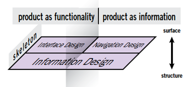

# Assignment 05: Working with the Elements of User Experience to Achieve Interface Success

## Table of Contents

<!-- TOC -->

- [Assignment 05: Working with the Elements of User Experience to Achieve Interface Success](#assignment-05-working-with-the-elements-of-user-experience-to-achieve-interface-success)
    - [Table of Contents](#table-of-contents)
    - [Overview](#overview)
    - [Part I: Map of Kenyan Gender Equity in Primary Schools (7 pts)](#part-i-map-of-kenyan-gender-equity-in-primary-schools-7-pts)
        - [The skeleton plane: information design, interface design, and navigation design](#the-skeleton-plane-information-design-interface-design-and-navigation-design)
            - [Information design: symbolizing geographic data](#information-design-symbolizing-geographic-data)
            - [Interface design: enable users to sequence through the data](#interface-design-enable-users-to-sequence-through-the-data)
            - [Interface design: building a proportional symbol legend](#interface-design-building-a-proportional-symbol-legend)
            - [Interface design: retrieving specific information with an info window](#interface-design-retrieving-specific-information-with-an-info-window)
            - [Including additional info viz graphics](#including-additional-info-viz-graphics)
            - [Interface design: adding grade level to the map (1 of 7 pts)](#interface-design-adding-grade-level-to-the-map-1-of-7-pts)
    - [The surface plane: sensory design](#the-surface-plane-sensory-design)
        - [Choosing colors](#choosing-colors)
        - [Choosing fonts](#choosing-fonts)
        - [Contextualizing the map and data](#contextualizing-the-map-and-data)
    - [Part II: Create a mockup – version 2 (3 pts)](#part-ii-create-a-mockup--version-2-3-pts)
        - [Deliverable](#deliverable)
    - [Challenge: Responsive design solution (+1 pt)](#challenge-responsive-design-solution-1-pt)
    - [Addendum: Flow of data in our application](#addendum-flow-of-data-in-our-application)

<!-- /TOC -->

## Overview

Most of the work in this module will be accomplished in Part I of the assignment. Except for the last section of Part I, the provided code should work verbatim. Be aware of where you are writing code, particularly whether you are inside or outside a function block. The [Addendum](#addendum-flow-of-data-in-our-application) shows the function declarations and the path of how data flows through the application. Part II continues our exploration of creating mockups of potential map projects.


## Part I: Map of Kenyan Gender Equity in Primary Schools (7 pts)

Begin by copying the Assignment 04 map files to this *assignment* directory. You should have the following files (and directories):
 
* index.html
* js/app.js
* css/styles.css
* data/kenya_education_2014.csv

You can also use the files found in the [backup](backup) folder. This lab follows from Module 04 and Lesson 05 and provides instruction for building a map that looks and behaves like this:

  
*Completed map for Module 05.*


### The skeleton plane: information design, interface design, and navigation design

According to Garrett, the skeleton plane further refines the structure of the application and makes the interface more tangible. Extending the question of, "How is this product going to work?", the skeleton plane asks, "What form will the functionality take?"

  
*Skeleton plane.*

We can see that Garrett considers "information design" to stretch across both the product as functionality and product as information, and involves the arrangement of elements on the interface to communicate information to the user. Interface design consists of the arrangement of elements to enable interaction, while navigation design involves the arrangement of elements to enable movement through the product.

We don't need to overly concern ourselves with disambiguating the distinction between interface and navigation design. The two are clearly related, and within web cartography, they likely overlap more than many of the web applications Garrett has in mind within his work and design.

The following section does a lot of work for us. Here's our roadmap moving through the remainder of this lesson:

1. We'll then dive back into the JavaScript to work on symbolizing our data as two distinct layers (in this case as proportional symbols), allowing us to both see the spatial distribution of the phenomena and make comparisons between the nominal categories of boys and girls
2. We'll then apply a slider UI element to sequence through the grades and the size of the proportional symbols
3. We'll consider an advanced solution for dynamically drawing a proportional symbol legend using HTML, CSS, and JavaScript
4. We'll build a custom information window to display content (better than a popup!) including a 'sparkline' chart
5. Finally, we'll consider techniques for ensuring our page displays and responds appropriately to module devices

Fire up your text editor and roll up your design and development sleeves!

#### Information design: symbolizing geographic data

In this map, we will convey information through traditional cartographic symbology. We can refer to some of the scripts and techniques we used to draw proportional symbols in the last lessons of MAP 672 (i.e., there's no need to reinvent the coding wheel every time).

In Lesson 04, we discussed the ways we come to choose one form of cartography symbology over another. In the case of this map, we anticipated using a proportional symbol for the county's enrollment levels. Let's now move into the JavaScript development needed to achieve this, as well as consider strategies that allow the user to compare the enrollment rates of girls vs. boys.

Recall that we ended Lab 04 with a responsive layout design, including a side panel, map, and UI-slider and legend elements added to the map.

  
*Prototype map with UI-slider and legend.*

What's our next step now? Returning to our mockups and information design strategy resulting from our requirements list, we know *we want to compare* the boys' and girls' enrollment rates across this map.

What is the range of possible interface design solutions for achieving this comparison? For one, we could create two layers to be toggled on and off (Roth's *overlay* work operator). Another (more static) solution would be to create two maps and place them side by side.

Instead, let's question even the need for the toggling to explore creating two distinct layers. Again, how do we achieve our map objectives with the minimal amount of user interaction required?

Even though the Omnivore Plugin conveniently converted the data into a map-ready Leaflet `L.geoJson` layer, we want to create two separate `L.geoJson` layers: one for girls and one for boys. Once we have these two separate layers, we'll consider strategies for comparing two map features.

Begin by editing the JavaScript code within your **lab-05/js/app.js** file. First, convert the Leaflet GeoJson layer back into regular GeoJSON data. Fortunately, there is an easy method with which to do this, `.toGeoJSON()`, which is documented both within [Leaflet's LayerGroup](http://leafletjs.com/reference.html#layergroup-togeojson) methods and [Mapbox.js API documentation for the L.Layergroup](https://docs.mapbox.com/mapbox.js/api/v3.3.1/l-layergroup/).

If we append this method to our `e.target`, we have access to a GeoJSON representation of our CSV data available in our script.

```javascript
 omnivore.csv('data/kenya_education_2014.csv')
    .on('ready', function(e) {
        // access to the GeoJSON here!
        console.log(e.target.toGeoJSON())
    })
    .on('error', function(e) {
        console.log(e.error[0].message);
}).addTo(map);
```

After adding the `toGeoJSON()` method to the `L.geoJson` object, we can see within the Console that we now have standard GeoJSON representation of our data within the script. We're now we're working with a GeoJSON data structure as if we had loaded GeoJSON with Query's`.getJSON()` method call.

Recall that because we've brought this data in as a CSV file, it's significantly smaller than a GeoJSON representation of the same data, so using the Omnivore plugin hasn't been a complete exercise in futility. How do we now go about create distinct features layer for girls and boys?

First, let's get the data out of that `.on('ready', function() {})` callback function. We can do this by simply calling a new function &ndash; let's name it `drawMap` &ndash; and sending our GeoJSON data to it. Modify the code then as follows (note that we're sending the argument as `e.target.toGeoJSON()` but the `drawMap` function accepts it as a parameter named `data`).

Also, remove the `addTo(map)` method chained to the end of the `omnivore.csv()` statement.


```javascript
omnivore.csv('data/kenya_education_2014.csv')
    .on('ready', function(e) {
        drawMap(e.target.toGeoJSON());
    })
    .on('error', function(e) {
        console.log(e.error[0].message);
});

function drawMap(data) {
    // access to data here
    console.log(data);
}
```

Next, we wish to create two separate layers within the drawMap function. Recall how back in MAP 672 we created separate layers for different types of power plants from the same GeoJSON data structure by filtering the coal plants from the hydro plants. Do we want to apply a similar technique here?

These layers will have the same features (i.e., a circleMarker for each county), so we don't want to apply a filter in this case. Instead, let's try creating two Leaflet GeoJSON layers.

Within the `drawMap() {}` declaration, let's First create some default options for creating circleMarkers from our GeoJSON point data. Place this code within the `drawMap()` function body

```javascript
function drawMap(data) {

  const options = {
    pointToLayer: function (feature, ll) {
      return L.circleMarker(ll, {
          opacity: 1,
          weight: 2,
          fillOpacity: 0,
      })
    }
  }

} // end drawMap()
```

Then, within the `drawMap()` function body, we can create two distinct `L.geoJson` layers from our GeoJSON data and fit the bounds of the map to one of those data layers.

```javascript
// create 2 separate layers from GeoJSON data
const girlsLayer = L.geoJson(data, options).addTo(map),
    boysLayer = L.geoJson(data, options).addTo(map);

// fit the bounds of the map to one of the layers
map.fitBounds(girlsLayer.getBounds());

// adjust zoom level of map
map.setZoom(map.getZoom() - .4);
```

These create Leaflet L.circleMarkers in place of the default makers.

  
*Markers converted to L.circleMarkers with default radius and color.*

We can then set the color of the two layerGroups independently. Obviously, there are cultural and historical associations with color. In this case, it would be cliche and problematic to choose pink for girls and blue for boys (right!?). Let's go with a couple of other colors and leave behind the gendered baggage?

For this map, We'll go with an orange color for girls (`#D96D02`) and a purple for boys (`#6E77B0`). These choices are neither simple nor easy. Beyond choosing colors that may be more or less politically correct, we also need to choose ones that work practically. Choose colors that allow the user to distinguish easily between the categories (beyond being aesthetically pleasing). For example, orange and purple are nearly complementary colors.

```javascript
girlsLayer.setStyle({
    color: '#D96D02',
});
boysLayer.setStyle({
    color: '#6E77B0',
});
```

The two layers are currently stacked atop one another, so it's difficult to see the orange color, but you can comment out one or the other to verify the color rule is being applied.

  
*L.circleMarkers colored independently.*

Next, we want to resize these circles. We can return to our final maps from MA P672 to remember how we do this using a `calcRadius()` function that accepts a number and calculates the radius of a circle given this number, returning it to the caller.

Write this function within your script (on the same nested level as the `drawMap()` function):

```javascript
function calcRadius(val) {

  const radius = Math.sqrt(val / Math.PI);
  return radius * .5; // adjust .5 as a scale factor

}
```

We've also adjusted the scale factor (i.e., that number we're multiplying the radius by) so the circles fit appropriately across the map. Now we can call this function when setting new radius values for our proportional symbols.

Just like the preceding labs in MAP 673, we can anticipate wanting to resize the circles every time we move the slider. So we don't want to set the radius for each circle within the same function that created them initially (i.e, not within the `drawMap()` function). 

Instead, we can create another function named `resizeCircles()` that accepts both our layerGroups and a current grade level.

In this case, the main question is what information we send into the `calcRadius()` function to use as the radius for our circles. Recalling how we created our data in Lesson 04 with the pivot table and manual editing, we know the grade numbers for the girls begin with `G1` and for the boys `B1`.

```javascript
function resizeCircles(girlsLayer, boysLayer, currentGrade) {

  girlsLayer.eachLayer(function (layer) {
    const radius = calcRadius(Number(layer.feature.properties['G' + currentGrade]));
    layer.setRadius(radius);
  });
  boysLayer.eachLayer(function (layer) {
    const radius = calcRadius(Number(layer.feature.properties['B' + currentGrade]));
    layer.setRadius(radius);
  });
}
```

Then, we can simply call this `resizeCircles()` function from within the `drawMap()` function body to kick off the thematic map:

```javascript
resizeCircles(girlsLayer, boysLayer, 1);
```

We can now see our circles have been dynamically resized based upon the grade 1 data attributes for each gender.

  
*L.circleMarkers resized independently.*

Upon visual inspection, the sizes of the circles appear very similar, and (simply) looking at the data earlier suggested the enrollment rates for girls and boys are nearly on parity. We can see the purple rings are slightly larger than the orange ones, in particular within counties with a greater difference between the two to the east.

Pause for a moment now to consider this design solution for achieving the objective of comparing the two feature sets. While we could have imagined an interaction solution (giving the user the ability to toggle on and off &ndash; the overlay operator in Roth speak &ndash; these two layers for comparison), this was not necessary. A simple static design solution is more straightforward and potentially more effective! Recall the discussion of **when** to apply cartographic interaction from Lesson 05.

#### Interface design: enable users to sequence through the data

While we achieved our first map objective of comparing the girls' and boys' enrollment rates by drawing hollow circles and giving each a distinct color, the second objective is also one of comparison: allowing the user to compare the rates across the grade levels. This is similar to earlier maps when we wanted the user to compare unemployment rates across time in Module 03.

Considering Roth's (2013) "work operators" described in Lesson 05, the **sequence** operator best allows us to achieve this particular objective. A slider widget is again a good choice for enabling this form of map interaction.

We've already run through the development of this form of interaction. We'll again consider three components of the design:
) The structural (HTML) element, in this case a native HTML `<input>` element.
) The CSS rules governing its position on the interface (and eventually its look and feel).
) The behavioral (JavaScript) functionality that will make the interface do what the user wants (i.e., sequence through the grades and have the map update accordingly). 
Let's handle the first two first.

In this case, we already created the HTML element and styled it using Assemply.css's class rules:

```html
<div id='slider' class='range w240 bg-white round-ml px12'>
  <input type='range' />
</div>
```

But we want to update it with initial attribute values for the range slider. We can hard code these attribute values onto the `<input>` HTML element itself, or for a challenge you could add these dynamically using JavaScript:

```html
<div id='slider' class='range w240 bg-white round-ml px12'>
  <input type='range' min="1" , max="8" , value="1" , step="1" />
</div>
```

Our UI slider element is available within the DOM. Recall that we use JavaScript to select the element and listen for user input or change. Our code needs to ensure that as the user slides the widget to sequence through the grade levels, the sizes of the circles will be updated to reflect the new data value.

Next, write a function called `sequenceUI()` and include two parameters, one for the `girlsLayer` and one for the `boysLayer`.

```javascript
function sequenceUI(girlsLayer, boysLayer) {
  
  // sequenceUI function body
  
}
```
Of course, if we're going to declare a function, we also need to call it from somewhere. In this case, we want to call it from where we have access to the values we wish to send as arguments. Call the `sequenceUI()` function from the bottom of the `drawMap()` function body:

```javascript
  sequenceUI(girlsLayer, boysLayer);

} // end drawMap()
```

First move the code from the Lab 05 starter code into this function that uses the `L.control()` method to select our slider and add it to the map.

```javascript
// create Leaflet control for the slider
const sliderControl = L.control({
  position: 'bottomleft'
});

sliderControl.onAdd = function (map) {

  const controls = L.DomUtil.get("slider");

  L.DomEvent.disableScrollPropagation(controls);
  L.DomEvent.disableClickPropagation(controls);

  return controls;

}

// add it to the map
sliderControl.addTo(map);
```

We're doing this to keep our script tidy and encapsulate as much of the code relating to a particular function within that function body.

We can then write code to select the slider and call our function to resize the circles with the updated grade level (pulled from the current value of the HTML range slider).

```javascript
//select the slider's input and listen for change
$('#slider input[type=range]')
  .on('input', function () {

    // current value of slider is current grade level
    var currentGrade = this.value;

    // resize the circles with updated grade level
    resizeCircles(girlsLayer, boysLayer, currentGrade);
  });
```

Saving these changes and testing your map will likely generate a Reference Error in the Console, saying that" `$ is not defined```. Why is this? Recall that the `$` symbol is short for jQuery.

We want to include a recent version of jQuery within our document as well if we haven't already. Include this element requesting the jQuery code before your custom JS code executes.

```html
<script src="https://cdnjs.cloudflare.com/ajax/libs/jquery/3.5.1/jquery.min.js"></script>
```

If we've written the code correctly, we can now drag the slider widget to sequence through the grade levels and resize the circles of both layerGroups.

  
*UI slider resizing circles.*

Next, let's build a legend for our map.

#### Interface design: building a proportional symbol legend

We want to build a proportional symbol legend, so the user has a sense of the relative magnitudes of these student enrollments. This legend doesn't need to be exact, and it's best to round the values within it. We can allow the user to derive specific values of mapped features with a retrieve operator, so the legend can be useful for giving an approximate sense of the data values.

Update the HTML, replacing the blue box we created in Lab 04 (`<div class='bg-blue h180 w240 mx-auto'></div>`) with the following markup (note all the Assembly.css classes!).

```html
<div id='legend' class='bg-white round px12 py12 relative'>
  <h3 class='txt-bold mb12 w180'>Legend Title</h3>
  <div class='legend-circles relative w180'>
    <div class="legend-large border border--gray-light absolute"></div>
    <div class="legend-small border border--gray-light absolute"></div>
    <div class="legend-large-label txt-m absolute"></div>
    <div class="legend-small-label txt-m absolute"></div>
  </div>
</div>
```

Now write a new function named `drawLegend()` and move the `L.control()` code from Lab 04 that adds the legend to the map to the `drawLegend()` function body.

We don't need the legend to update with each change in the map, but we can still dynamically size the circles within it, given the max and median of the data values range. To do so, we could loop through the `boysLayer` or `girlsLayer` and push all the values for each grade into an array. 

Add the following function call up within the Omnivore callback function, beneath where we sent the data to the `drawMap()` function:

```javascript
drawMap(e.target.toGeoJSON());
drawLegend(e.target.toGeoJSON());  // add this statement
```

Modify your `drawLegend()` function definition to accept this parameter:

```javascript
function drawLegend(data) {
  
  // function body
```

Next, we can use the JavaScript `forEach()` method (which acts on arrays) to iterate through each feature of the GeoJSON data, and for each feature, we can iterate through the properties and push the numeric values for each grade level into an array. We also need to provide some kind of conditional test to make sure we don't push our county names into the array, here simply a test to see if the value can be converted to a number.

```javascript

// empty array to hold values
const dataValues = [];

// loop through all features (i.e., the schools)
data.features.forEach(function (school) {
  // for each grade in a school
  for (let grade in school.properties) {
    // shorthand to each value
    const value = school.properties[grade];
    // if the value can be converted to a number 
    // the + operator in front of a number returns a number
    if (+value) {
      //return the value to the array
      dataValues.push(+value);
    }

  }
});
// verify your results!
console.log(dataValues);
```

Once that loop finishes, we want to derive the maximum value from it. We can do this by sorting it high to low and accessing the first element of the array.

```javascript
// sort our array
const sortedValues = dataValues.sort(function(a, b) {
    return b - a;
});

// round the highest number and use as our large circle diameter
const maxValue = Math.round(sortedValues[0] / 1000) * 1000;
```

You'll want to be writing some `console.log()` statements throughout this process to understand and verify the results, as well as to debug if you're getting errors or the resultant array or `maxValue` value isn't correct.

Once we have our maximum value, we can use this (and half of it for a smaller legend circle) to select the HTML div elements we wrote into *index.html* and dynamically resize and position them.

There's some fancy jQuery and CSS ninjutsu we're generating with the JavaScript in what follows, so study it carefully. Comments are provided here to help us understand.

```javascript
// calc the diameters
const largeDiameter = calcRadius(maxValue) * 2,
    smallDiameter = largeDiameter / 2;

// select our circles container and set the height
$(".legend-circles").css('height', largeDiameter.toFixed());

// set width and height for large circle
$('.legend-large').css({
    'width': largeDiameter.toFixed(),
    'height': largeDiameter.toFixed()
});
// set width and height for small circle and position
$('.legend-small').css({
    'width': smallDiameter.toFixed(),
    'height': smallDiameter.toFixed(),
    'top': largeDiameter - smallDiameter,
    'left': smallDiameter / 2
})

// label the max and median value
$(".legend-large-label").html(maxValue.toLocaleString());
$(".legend-small-label").html((maxValue / 2).toLocaleString());

// adjust the position of the large based on size of circle
$(".legend-large-label").css({
    'top': -11,
    'left': largeDiameter + 30,
});

// adjust the position of the large based on size of circle
$(".legend-small-label").css({
    'top': smallDiameter - 11,
    'left': largeDiameter + 30
});

// insert a couple hr elements and use to connect value label to top of each circle
$("<hr class='large'>").insertBefore(".legend-large-label")
$("<hr class='small'>").insertBefore(".legend-small-label").css('top', largeDiameter - smallDiameter - 8);
```

The result is some dynamically resized and position circles with labels, except they are squares!

  
*Dynamically resized and position squares.*

We've done most of the styling of these elements using Assembly.css, but we'll need to select the elements and apply a few CSS style rules of our own to achieve the desired result. Insert these CSS rules within your **css/styles.css** file:

```css
.legend-large, .legend-small {
    border-radius: 50%;
}

hr.small, hr.large {
    width: 83px;
    position: absolute;
    top: -8px;
    left: 55px;
    border: 1px dashed #ccc;     /* overwrite assembly.css rule */
    margin-top: 8px;            /* overwrite assembly.css rule */
}

```

As we can see, making the `border-radius` of a square div element '50 %` makes it appear as a circle. And we use the dotted hr elements to connect the value labels to the circles in a subtle, attractive way.

  
*Dynamically resized and position circles.*

With our legend and slider now complete, we can move on to explore UI/UX solutions for another of Roth's operators: retrieving specific information about these features.

#### Interface design: retrieving specific information with an info window

The Leaflet.js/Mapbox.js libraries provide the nifty popups and tooltips for quickly allowing a user to access information in the default popup and providing the means for this popup to be styled in different ways.

However, building a custom information window has some advantages in that we can structure our content the way we wish and have better control over how the user interacts with our features.

Our solution for a custom info window that pops up when we hover over a feature is very similar to information panels we've made in Module 02 that display additional information about selected features. In those cases, we placed the info panel somewhere within the interface layout using absolute positioning (or the `L.control()` class).

In this case, we'll add some additional code that allows the position of the info window to follow the mouse (or to be placed where the user touches the screen).

Let's modify our HTML first and add a new div element that will represent our info window. We'll give it an id attribute of `info`. We can also apply some classes from Assembly.css for styling in a consistent way with the rest of our design.

Paste within the HTML document outside of other `<div></div>` tags at the bottom of the document). Using the `fixed` positioning property, it will be positioned relative to the viewport, so in the top-right corner. 

```html
<!-- ui info panel -->
<div id='info' class='py6 px12 bg-white border border--gray-light round fixed top right w240'>
</div>
```

This `info` element is not a Leaflet control layer, like the slider or legend elements. We need to control how map and info elements overlap and make the `info` element draw above the map. The [z-index](https://www.w3schools.com/cssref/pr_pos_z-index.asp) property can be set in our CSS rules to control the stacking of overlapping elements. Leaflet has a [default z-index value](https://leafletjs.com/reference.html#map-pane) for its panes and we need to make a CSS rule for the `info` that is higher than Leaflet's highest value, which is `700` for the popup. Add the following rule to the CSS:

```css
#info {
    z-index: 1000;
}
```

Within those division tags, we'll structure content using paragraph tags (you may also consider using a list element for this or additional div elements). We'll add some extra classes to the last two paragraph tags for styling (`girls` and `boys`).

We also include two sets of empty span tags. We'll use these span tags to dynamically insert content on the mouseover: the first will hold the current grade level, and the second will be the raw totals.

```html
<p>County: <span></span></p>
  <p class='girls'>girls <span></span>: <span class='txt-l txt-bold'></span></p>
  <p class='boys'>boys <span></span>: <span class='txt-l txt-bold'></span></p>
```

We're going to use those classes of `girls` and `boys` to give the text a color corresponding with their respective circle colors. We need to write a custom CSS rule within our **css/styles.css** style sheet file:

```css
.boys {
    color: #6E77B0;
}

.girls {
    color: #D96D02;
}
```

We've taken care of the structure and form of the info window. Next, let's write JavaScript to display and populate it with specific feature information on hover.

Write a new function named `retrieveInfo()` with parameters of `boysLayer` and `currentGrade` (since we can access all the data for the boys as well within the  `boysLayer` we don't need them both):

```javascript
function retreiveInfo(boysLayer, currentGrade) {
  // function body 
}
```

We want to call this function every time we update the proportional symbols (we need to know the current grade). One temptation may be to call it within our slider UI's callback function. But what's the problem with this? Recall that we first call the `reSizeCircles()` function once within our `drawMap()` function (to initially size the circles). Therefore it's better to place this function call at the end of the `reSizeCircles()` function to enable the retrieve info functionality before the user begins sliding the UI slider widget.

```javascript
// update the hover window with current grade's
retrieveInfo(boysLayer, currentGrade);
```

Within the `retrieveInfo())` function we want to:

* select the element and reference with variable
* since `boysLayer` is on top of `girlsLayer`, use it to detect mouseover events
* remove the `none` class to display the element
* derive the properties of the target layer
* populate our info window HTML elements with the relevant information (using jQuery to select these elements)
* change the appearance of the target circleMarker as an additional affordance

Within the callback function of the mouseover, we'll first access the properties of that specific feature using the event passed to the callback function (`e`) and create a shortcut to those properties assigned to the variable `props`. We can then select our infoWindow div using jQuery and display it (using jQuery to remove the `none` class and the [jQuery method `.show()`](http://api.jquery.com/show)).

We then want to populate the info window with the following information:

* the name of the current county the user is hovering over
* the current grade level selected by the slider widget
* the raw total for the girls for that county and current grade
* the raw total for the boys for that county and current grade

Experiment with the following JS within your `retrieveInfo()` function.

```javascript
  // select the element and reference with variable
  // and hide it from view initially
  const info = $('#info').hide();

  // since boysLayer is on top, use to detect mouseover events
  boysLayer.on('mouseover', function (e) {

    // remove the none class to display and show
    info.show();

    // access properties of target layer
    const props = e.layer.feature.properties;

    // populate HTML elements with relevant info
    $('#info span').html(props.COUNTY);
    $(".girls span:first-child").html(`(grade ${currentGrade})`);
    $(".boys span:first-child").html(`(grade ${currentGrade})`);
    $(".girls span:last-child").html(Number(props[`G${currentGrade}`]).toLocaleString());
    $(".boys span:last-child").html(Number(props[`B${currentGrade}`]).toLocaleString());

    // raise opacity level as visual affordance
    e.layer.setStyle({
      fillOpacity: .6
    });
  
  });
```

Note how we're able to differentiate between the two span tags within each paragraph using the CSS pseudo-selectors of `first-child` and `last-child`.

We can also give this user an additional visual affordance that they've moused over that symbol by giving it a fill color. When the user mouses off our features, we want to hide the info window and remove the visual affordance.

```javascript
// hide the info panel when mousing off layergroup and remove affordance opacity
boysLayer.on('mouseout', function(e) {
    
    // hide the info panel
    info.hide();
    
    // reset the layer style
    e.layer.setStyle({
        fillOpacity: 0
    });
});
```

You should see the info window appearing in the top right corner of the map when mousing over features.

  
*Dynamically generated info window.*

We can further enhance the user experience by having the info window follow the mouse when hovering over target features, as well as flipping to the left if the window crashes into the side of the browser window and flipping down if crashing into the top. 

Examine and try the following code, and note that you'll need to remove the `top` and `right` class names from the HTML element here (within the **index.html** file):

```html
<div id='info' class='py6 px12 bg-white border border--gray-light round fixed w240'>
```

Once you've moved those two class names, include the following code at the bottom of your `retrieveInfo()` function body:

```javascript
// when the mouse moves on the document
$(document).mousemove(function(e) {
    // first offset from the mouse position of the info window
    info.css({
        "left": e.pageX + 6,
        "top": e.pageY - info.height() - 25
    });

    // if it crashes into the top, flip it lower right
    if (info.offset().top < 4) {
        info.css({
            "top": e.pageY + 15
        });
    }
    // if it crashes into the right, flip it to the left
    if (info.offset().left + info.width() >= $(document).width() - 40) {
        info.css({
            "left": e.pageX - info.width() - 80
        });
    }
});
```

If written correctly, the info window should now follow the mouse pointer when hovering over the circles. This has the advantage of not drawing the user's eye from the target feature of interest. It can also feel like a smoother user experience.

  
*Dynamically generated info window.*

We've now built a custom info panel for retrieving feature-specific information.

#### Including additional info viz graphics

An addition we can consider is adding a "sparkline" chart to our info window, which will allow the user to see the overall trend or data range for a specific feature, without having to sequence through the data using the UI slider.

To do this, we'll import yet another JS library, one that extends jQuery to provide additional charting functionality: [jQuery Sparkline](http://omnipotent.net/jquery.sparkline/). You'll note that this library is a bit dated (~2004 but updated in 2013, yay!), and though it still works well for our purpose here, this same technique could be applied with any JS library ([D3.js](https://d3js.org/), [Chart.js](http://www.chartjs.org/)).

Check out the documentation for jQuery Sparklineand then add the library to your document (pulling from the cloudflare CDN). **Important:** note that you'll want to load this after jQuery is loaded because the sparkline plugin is dependent upon jQuery.

```html
<script src="https://cdnjs.cloudflare.com/ajax/libs/jquery-sparklines/2.1.2/jquery.sparkline.min.js"></script>
```

If we examine the [documentation for jQuery sparkline](http://omnipotent.net/jquery.sparkline/#s-docs), we know we need to feed the `.sparkline()` method an array of the data values we want plotted.

Within our `retrieveInfo()` function, when mousing over our `boysLayer` featureGroup, we need to assemble an array of these values for the girls enrollment rates and one for the boys, for the specific feature being targeted.

Let's first add some HTML elements to our *index.html* file to hold the sparkline information, within our `<div id='info'></div>` tags.

```html
<div id='info' class='py6 px12 bg-white border border--gray-light round fixed w240'>
  <p>County: <span></span></p>
  <p class='girls'>girls <span></span>: <span class='txt-l txt-bold'></span></p>
  <p class='boys'>boys <span></span>: <span class='txt-l txt-bold'></span></p>

  <!-- Additional elements added here for this step! -->
  <hr class='txt-hr'>
  <p class='my6'>trend: grades 1 &ndash; 8</p>
  <p class='mb6'><span class='girlspark'></span></p>
  <p><span class='boyspark'></span></p>
</div>
```

Next, let's write some JavaScript to loop through a specific feature's properties and push all values to an array (this technique should be becoming familiar to you). Note that we want to do this within the `boysLayer.on('mouseover', function (e) { ... }` callback function.

```javascript    
// empty arrays for boys and girls values
const girlsValues = [],
  boysValues = [];

// loop through the grade levels and push values into those arrays
for (let i = 1; i <= 8; i++) {
  girlsValues.push(props['G' + i]);
  boysValues.push(props['B' + i]);
}
```

We can then use jQuery to select the elements using the `girlspark` and `boyspark` class names and invoke the `.sparkline()` method, passing the arrays of values as arguments. Note here we include some additional options as a second argument for the look and feel of the sparklines (keeping the colors consistent with our design so far).

```javascript
$('.girlspark').sparkline(girlsValues, {
    width: '200px',
    height: '30px',
    lineColor: '#D96D02',
    fillColor: '#d98939 ',
    spotRadius: 0,
    lineWidth: 2
});

$('.boyspark').sparkline(boysValues, {
    width: '200px',
    height: '30px',
    lineColor: '#6E77B0',
    fillColor: '#878db0',
    spotRadius: 0,
    lineWidth: 2
});
```

We can now get a sense of a specific feature's overall trend with one static "sparkline" chart when retrieving specific feature information.

  
*Dynamically generated info window with sparkline.*

Our application is now becoming a robust data visualization tool. If you have arrived here with a functioning map, congratulations! Let's now take a bit of success and tackle adding a grade level legend item.

#### Interface design: adding grade level to the map (1 of 7 pts)

Note within the finalized map there is a small element above the slider in the lower left hand of the map. This element displays the current grade level when the user drags the slider.

  
*Temporal legend updating with the slider.*


Your task is to extend the code further to provide this functionality. Consider:

* building an HTML division element to structure the content
* applying some Assembly.css style rules to the element using class definitions
* writing JavaScript to populate the element with content and update the content when the user drags the slider widget

Hint: work inside the `sequenceUI()` function.

When complete, your map should be fully functional and meet the user-centered requirements originally established within Lesson 04. You are welcome to continue modifying and customizing your map in the next section, where we explore select distinct typefaces and colors.

## The surface plane: sensory design

As Garrett writes, at the top of our design model we have the **surface plane**, that which involves our design of "those aspects of the product our users will notice first."

Within the surface plane the content, functionality, and aesthetics come together while "fulfilling all the goals of the other four planes." This is where we can start to make the map and interface look nice and a pleasure to use.

  
*Surface plane.*

As we enter the surface plane we think more concretely about the specifics of the visual design. These will include commitments to color choices, typefaces, and whitespace.

Moving forward, practice personalizing and customizing the look and feel of the surface plane of the map. This could primarily involve modifying the framework's CSS class rules (e.g., you'll want to spend some time looking through the [Assembly.css documentation](https://www.mapbox.com/assembly/documentation/)) and writing your own custom CSS rules. Spend as much time as you want, but make sure you get comfortable selecting distinct colors and typeface combinations.

### Choosing colors

Choosing colors is an essential yet challenging part of any design process. In the case of this map, we need to think of colors in two sense: 1.) the colors we're for the data visualization itself (i.e., the proportional symbols), and 2.) supplementary colors used across the interface and for anecdotal text.

Earlier, we identified a couple of colors we used for encoding the girls' and boys' circles (an orange `#D96D02` for girls and a purple `#6E77B0` for the boys). For the rest of the layout and design, try limiting the design to one other accent color (or borders, subheadings, links, etc.), and then use a white or off-white (for backgrounds) and a muted black color for text. An alternative challenge would be to go with a dark motif (dark grey backgrounds with white or light gray text).

It's often handy to establish a color scheme and copy the hex values for the colors into commented CSS rules for easy access. For help picking good color schemes, consider [exploring some color schemes with Adobe Color](https://color.adobe.com/create).

### Choosing fonts

While Assembly.css provides a default typeface of "Open Sans,"" we can override these style rules and use another typeface of our choosing.

We can apply a new web font to the entire body element of our document, or target specific elements like headings, paragraphs, or the text within our legend or info window.

For example, go to [Google fonts](https://www.google.com/fonts) and search for a font called [Work Sans](https://www.google.com/fonts/specimen/Work+Sans).

Let's give us [3 different font weights to work with](https://www.google.com/fonts#UsePlace:use/Collection:Work+Sans:400,500,600), the normal (400), medium (500), and semi-bold (600).

In the head of our document, we can load the new font when the page loads by placing this text within it:

```html
<link href='https://fonts.googleapis.com/css?family=Work+Sans:400,500,600' rel='stylesheet' type='text/css'>
```
Now let's select the `body` element and apply the font rule. This will override Assembly.css for this specific rule.

```css
body {
    font-family: "Work Sans", sans-serif;
}
```

Note that we're only using one typeface here. It's best to use no more than two if possible. Consider searching the web for [web font pairings](http://bfy.tw/5DOm) to get advice and ideas for what fonts work well together.

### Contextualizing the map and data

Finally, clean up the side column content and replace/remove any of the lorem ipsum filler text. You want the overall map to feel complete. Give the user a sense of the "what, where, and when" of the mapped phenomena. Link to the data source, and update "authored by" info.

Consider using subheadings and list elements to make information more easily readable, rather than full paragraphs. Include relevant images if you wish (save images within another directory named *images/* and link within the page using a relative path, e.g., `src='images/kenyan-school.png").

Consider how you'd include subtle elements in the legend, letting the user know which color refers to which gender:


## Part II: Create a mockup – version 2 (3 pts)

Read [Chapter Five of Frank Chimero's _The Shape of Design_, "Fictions and Bridges](https://shapeofdesignbook.com/chapters/05-fiction-and-bridges/)." 

Within this chapter, Chimero argues that good design works as bridge between an activity and an audience. When you read a book, the author's creative activity is conveyed in the form of text on a page or screen. The designer has the power to complicate the message of the author by using an ill-suited typeface, for example. Good design calibrates the tone of a message pitch-perfectly.

Such thinking resonates with the discussion of user-centered design covered in lessons 04 and 05. Roth describes interface design as the medium facilitating a dialogue between the human and the map and prescribes various ways design should tailor an experience with the user's objectives and needs in mind. Likewise, we think about these objectives in terms of "personas" and "scenarios."

Continue to think about ideas for your MAP673 final project. In the previous lesson we made a lo-fi wireframe or mockup of a web map and page. Similarly, get a new sheet of paper (or a new canvas in your favorite design app) and, this time, try to be more specific and discover a *tone* for the project. 

At the top of the page, answer the following questions with a few words or short sentence:

* What?
* Where?
* Why?
* When?

For example, it could be:

* Grocery stores
* Downtown Lexington
* Need access to healthy food
* During the time of COVID-19

These words can form the outline of your message. We'll develop this message more thoroughly in the next module's assignment. Now, sketch a mockup of the page with a focus on the user interface. Identify design traits that complement and propel your message. Specifically, identify on your layout and label:

* Two typefaces by name (e.g., Open Sans italicized, 300 weight and use [Google Fonts](https://fonts.google.com/))
* Two colors in the UI by name (e.g., [web color names](https://en.wikipedia.org/wiki/Web_colors), RGBA, hex, or use a [color picker](https://www.w3schools.com/colors/colors_picker.asp))
* One graphic, icon, or image and where it might be placed in the layout. This might be a background image, a logo, etc. (Find Creative Common [icons](https://thenounproject.com/) and [photos](https://www.pexels.com/), or make your own!).

The more detail you can provide, the faster you can start testing these choices and prototyping with a framework. Our goal is to discover a theme, so have fun!


### Deliverable

Create a mockup of this page. Feel free to draw by hand and scan or take a picture of, or use a computer or web-based application, to produce a digital image of this wireframe/mockup. Save this image as a PNG or JPG in your assignment folder.


## Challenge: Responsive design solution (+1 pt)

If you test the responsiveness of our map of school enrollment, you'll notice that the legend, which we dynamically placed on the map using Leaflet's `L.Control()` class, gets in the way of the mapped features and crashes into the UI slider at smaller widths.


*Responsive legend crashing*

Design and implement a solution to avoid this. There are many options, but one approach would be not to display the legend at smaller widths unless a toggle button is used:


*Responsive legend solution*

Similarly, think about the info window. How does it respond to smaller screen sizes?

## Addendum: Flow of data in our application

To help understand the flow of data in our application, study the parameters in the function declarations and the sequence of execution.


*Flow of data*

In the below code block, an overview of what each function does is provided.

```js
omnivore.csv('data/location/file.csv')
  .on('ready', function (data) {
    // Use omnivore to load the CSV data
    // Draw the map and legend
  })
  
function drawMap(data) {
  // draw map function
  // Set default style
  // Create 2 separate layers, by gender, from GeoJSON data
  // Update circle sizes with first grade
  // Create slider/sequence UI
}

function drawLegend(data) {
  // Loop through all schools to get all values
  // Sort results
  // Calculate the largest diameter
  // Modify the CSS rules in the legend Leaflet control to draw two squares
  // Draw labels
}

function resizeCircles(girlsLayer, boysLayer, currentGrade) {
  // Update girl circle sizes with value selected in slider 
  // Update boy circle sizes with value selected in slider
  // Retrieve data for info window
}

function calcRadius(value) {
  // Calculate radius
}

function sequenceUI(girlsLayer, boysLayer) {
  // Create Leaflet control for the slider
  // Select the slider's input and listen for change
  // Resize the circles with updated grade level
}

function retrieveInfo(boysLayer, currentGrade) {
  // ** Need only one layer because both layers have the same data **
  // On mouseover, show info window
  // Access CSV properties by currently selected grade level
  // Populate info window with properties
  // Create array of school enrollment by grade and gender and draw sparkline
  // Detect location of mouse and offset window based on proximity to viewport
}
```


